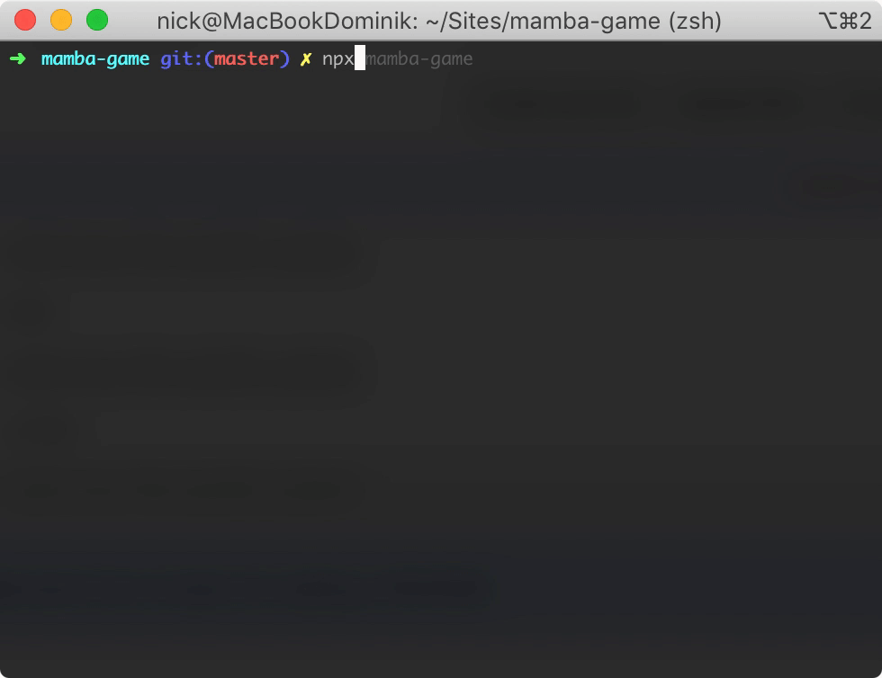

# 🕷 mamba-game

## Starting the game

```bash
npx mamba-game
```

Simply open your terminal and run `npx mamba-game`.

## Gameplay Demo



## How to play

You are a tiny mamba spider playing against a claustrophobic snake.

Use the arrow keys to walk the spider.

You complete a level by covering enough free space with your spider web. The snake can break your string by slithering through it.

You have to complete a new web at least every thirty seconds to keep the game interesting.

☮ Don't let the snake eat you.

## Inspiration

I loved playing Mamba as a kid, but I couldn't find a version for the Mac and was kinda bored.

You can see what the original looked like in [this video](https://www.youtube.com/watch?v=NCpGDv0ljes&t=85s).
